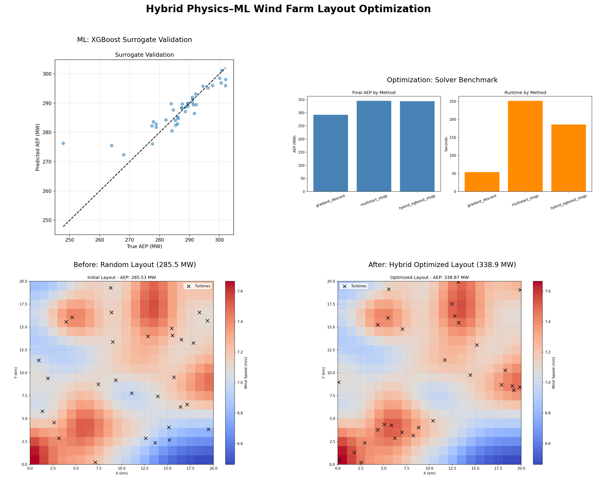

# Hybrid Physics–ML Wind Farm Layout Optimization

Optimizes wind turbine placement on a spatial wind resource map to **maximize Annual Energy Production (AEP)** under wake effects, site boundaries, and minimum spacing constraints.

This project combines:

- **Physics-based simulation** — Jensen wake model, turbine power curve, constraint checks
- **Constrained optimization** — gradient descent, L-BFGS-B, SLSQP, multistart search
- **ML surrogate modeling** — XGBoost trained on simulated layouts for fast AEP prediction

The ML layer accelerates candidate search; the physics engine remains the ground truth for final validation and refinement.

---

## Table of Contents

- [Problem Statement](#problem-statement)
- [Solution Overview](#solution-overview)
- [System Architecture](#system-architecture)
- [Core Components](#core-components)
- [Optimization Formulation](#optimization-formulation)
- [End-to-End Workflow](#end-to-end-workflow)
- [Tech Stack](#tech-stack)
- [Project Structure](#project-structure)
- [Getting Started](#getting-started)
- [Usage](#usage)
- [Results](#results)
- [What This Project Demonstrates](#what-this-project-demonstrates)
- [Roadmap](#roadmap)
- [Author](#author)
- [License](#license)


---

## Problem Statement

Wind farm efficiency depends heavily on where turbines are placed. Poor placement causes:

- Lower energy capture in weak-wind zones
- High wake losses when upstream turbines reduce wind speed for downstream units
- Violations of minimum spacing and site boundary constraints

This is a **constrained, non-convex optimization problem**: choose turbine coordinates that maximize energy output while satisfying physical and spatial rules.

| Challenge | Description |
|-----------|-------------|
| Non-convex objective | Wake interactions create coupled nonlinear effects and local optima |
| Expensive evaluation | Full physics simulation is slow when scoring thousands of layouts |
| Hard constraints | Turbines must stay inside the site and maintain safe separation |
| Spatial variability | Wind speed changes across the farm area |

---

## Solution Overview

The system uses a three-layer hybrid design:

```
Physics simulator  →  computes true AEP for any candidate layout
ML surrogate       →  learns to approximate AEP from layout features for fast screening
Optimization engine → refines top layouts using classical constrained solvers
```

```
Wind Map → Physics Simulator → Labeled Layout Dataset
                                      ↓
                              XGBoost Surrogate
                                      ↓
                         Fast Candidate Screening
                                      ↓
                    Top-K Layouts → Constrained Optimizer
                                      ↓
                         Validated Optimal Layout
```

**Design principle:** ML speeds up search; physics validates the final answer.

---

## System Architecture

```
┌─────────────────────────────────────────────────────────────────┐
│                         INPUT LAYER                             │
│  wind_speed_map.csv  ·  turbine count  ·  site constraints      │
└───────────────────────────────┬─────────────────────────────────┘
                                │
                                ▼
┌─────────────────────────────────────────────────────────────────┐
│                    PHYSICS ENGINE (Ground Truth)                │
│  ┌──────────────┐  ┌──────────────┐  ┌───────────────────────┐  │
│  │ Power Curve  │  │ Jensen Wake  │  │ Spacing & Boundary    │  │
│  │   Model      │  │    Model     │  │    Constraints        │  │
│  └──────────────┘  └──────────────┘  └───────────────────────┘  │
│                         AEP Objective Function                  │
└───────────────────────────────┬─────────────────────────────────┘
                                │
              ┌─────────────────┴─────────────────┐
              ▼                                   ▼
┌──────────────────────────┐        ┌─────────────────────────────┐
│      ML SURROGATE        │        │   OPTIMIZATION ENGINE       │
│  Feature Engineering     │        │  Penalty Gradient Descent   │
│  XGBoost Regressor       │        │  L-BFGS-B · SLSQP           │
│  Fast AEP Prediction     │        │  Multistart · Hybrid Refine │
└────────────┬─────────────┘        └──────────────┬──────────────┘
             │                                     │
             └─────────────────┬───────────────────┘
                               ▼
┌─────────────────────────────────────────────────────────────────┐
│                        OUTPUT LAYER                             │
│  Optimal layout · AEP metrics · convergence plots · benchmarks  │
└─────────────────────────────────────────────────────────────────┘
```

---

## Core Components

### 1. Data & Site Model

- **Wind resource grid:** 20×20 spatial map over a 20 km × 20 km site (`wind_speed_map.csv`)
- **Turbines:** configurable count (default: 30)
- **Wind modeling:** multi-direction wind rose with per-direction probabilities (see `configs/experiment.yaml`)

### 2. Physics-Based Simulator

| Module | Purpose |
|--------|---------|
| Turbine power curve | Maps wind speed to power output (cut-in, partial, rated, cut-out) |
| Jensen wake model | Estimates velocity deficit from upstream turbines |
| Spacing constraints | Enforces minimum distance (5× rotor diameter, e.g. 400 m) |
| Boundary constraints | Keeps turbines inside the site with safety margin |
| AEP objective | Aggregates wake-adjusted power across all turbines and wind directions |

### 3. Optimization Module

| Solver | Role |
|--------|------|
| Penalty + gradient descent | Baseline iterative optimizer with constraint penalties |
| L-BFGS-B | Quasi-Newton method with bound constraints |
| SLSQP | Nonlinear constrained optimization via SciPy |
| Multistart | Multiple random initializations to escape poor local optima |
| Hybrid ML-guided search | Surrogate prefilter + physics-based refinement |

### 4. ML Surrogate (XGBoost)

The surrogate approximates the expensive physics evaluator:

- **Training data:** random/heuristic layouts labeled with true physics AEP
- **Features:** mean wind at turbine sites, spacing statistics, wake exposure, layout spread
- **Model:** XGBoost regressor predicting AEP from layout features
- **Usage:** score large candidate sets quickly; re-evaluate top layouts with full physics

### 5. Evaluation & Benchmarking

- Surrogate accuracy: RMSE, MAE, R²
- Optimization quality: final AEP vs random baseline
- Efficiency: runtime and number of physics evaluations
- Convergence: objective history over iterations
- Constraint satisfaction: spacing and boundary feasibility

---

## Optimization Formulation

**Decision variables:**

```
z = (x₁, y₁, x₂, y₂, ..., xₙ, yₙ)   ∈ R^(2N)
```

**Objective:**

```
maximize   AEP(z) = Σᵢ Power(vᵢ(z))
```

where `vᵢ(z)` is the wake-adjusted wind speed at turbine *i*.

**Constraints:**

```
(xᵢ, yᵢ) ∈ Ω                         (site boundary)
||(xᵢ, yᵢ) - (xⱼ, yⱼ)|| ≥ 5D         (minimum spacing, D = rotor diameter)
```

**Wake-adjusted wind speed:**

```
vᵢ = vᵢ_free - Σⱼ≠ᵢ wake_deficit(i, j, wind_direction)
```

Expected AEP is computed as a probability-weighted sum over wind directions in the wind rose.

---

## End-to-End Workflow

1. Load the wind resource map
2. Generate a synthetic dataset of turbine layouts using the physics simulator
3. Train an XGBoost surrogate on layout features → AEP
4. Use the surrogate to score a large set of candidate layouts
5. Select top-K layouts for full physics evaluation
6. Refine the best layouts with constrained optimizers (SLSQP / multistart)
7. Validate spacing and boundary feasibility
8. Compare against baselines and export results

Run the full pipeline in one step:

```bash
bash scripts/run_pipeline.sh
```

---

## Tech Stack

| Area | Tools |
|------|-------|
| Language | Python 3.8+ |
| Optimization | NumPy, SciPy (`minimize`, SLSQP, L-BFGS-B) |
| Machine Learning | XGBoost, scikit-learn |
| Data | Pandas, NumPy |
| Visualization | Matplotlib, Seaborn |
| Environment | Jupyter Notebook, modular Python package |
| Engineering | pytest, YAML configs, CLI runner |

---

## Project Structure

```text
├── src/wind_farm_opt/
│   ├── data/              # wind map loading and interpolation
│   ├── physics/           # power curve, Jensen wake, AEP simulator
│   ├── constraints/       # spacing and boundary checks
│   ├── optimization/      # GD, SLSQP, multistart, hybrid pipeline
│   ├── ml/                # dataset generation, XGBoost surrogate
│   ├── evaluation/        # metrics, benchmarks, plots
│   └── cli.py             # command-line entry point
├── configs/experiment.yaml
├── scripts/run_pipeline.sh
├── tests/
├── data/                  # generated layout datasets
├── models/                # trained surrogate models
├── outputs/               # plots and benchmark CSV
├── WindFarmOptimization.ipynb
├── wind_speed_map.csv
├── pyproject.toml
├── requirements.txt
└── README.md
```

---

## Getting Started

### Prerequisites

- Python 3.8+
- pip

### Installation

```bash
git clone https://github.com/Muskansuman/Wind-Farm-Layout-Optimization.git
cd Wind-Farm-Layout-Optimization

python -m venv .venv
source .venv/bin/activate        # Linux/macOS
# .venv\Scripts\activate         # Windows

pip install -e .
```

---

## Usage

### Full hybrid pipeline

```bash
python -m wind_farm_opt generate-dataset --samples 800 --output data/layouts.csv
python -m wind_farm_opt train-surrogate --train data/layouts.csv --model models/aep_surrogate.json
python -m wind_farm_opt optimize --solver hybrid --seed 42
python -m wind_farm_opt benchmark
```

All commands accept `--config configs/experiment.yaml` to override site, turbine, and solver settings.

### Other solvers

```bash
python -m wind_farm_opt optimize --solver gradient_descent --seed 42
python -m wind_farm_opt optimize --solver slsqp --seed 42
python -m wind_farm_opt optimize --solver lbfgsb --seed 42
python -m wind_farm_opt optimize --solver multistart --seed 42
```

### Baseline notebook

```bash
jupyter notebook WindFarmOptimization.ipynb
```

### Run tests

```bash
pytest
```

---

## Results

Benchmark run on a **20 km × 20 km** site with **30 turbines**, seed `42`.

### Baseline

| Metric | Value |
|--------|-------|
| Random initial layout AEP | 285.53 MW |
| Site grid | 20 × 20 wind speed map |
| Min turbine spacing | 400 m (5× rotor diameter) |

### Solver comparison

| Method | AEP (MW) | Improvement vs baseline | Runtime (s) | Physics evals | Feasible |
|--------|----------|-------------------------|-------------|---------------|----------|
| Gradient descent | 292.17 | +2.33% | 53.6 | 3,025 | Yes |
| Multistart SLSQP | **345.74** | **+21.09%** | 251.5 | 2,512 | Yes |
| Hybrid XGBoost + SLSQP | 343.91 | +20.45% | 185.7 | 9,401 | Yes |

### ML surrogate performance

| Metric | Value |
|--------|-------|
| Model | XGBoost regressor |
| Training samples | 800 layouts |
| RMSE | 3.11 MW |
| MAE | 2.27 MW |
| R² | 0.90 |

### Hybrid optimization (standalone run)

| Metric | Value |
|--------|-------|
| Final AEP | 338.87 MW |
| Surrogate screenings | 500 layouts |
| Top layouts refined with SLSQP | 5 |
| Final layout feasible | Yes |

### Generated outputs

| File | Description |
|------|-------------|
| `outputs/portfolio_ml_optimization.png` | Combined ML + optimization summary figure |
| `outputs/benchmark_results.csv` | Full benchmark metrics |
| `outputs/initial_layout.png` | Random turbine placement on wind heatmap |
| `outputs/optimized_layout.png` | Optimized layout after hybrid search |
| `outputs/convergence.png` | AEP convergence over iterations |
| `outputs/benchmark_comparison.png` | AEP and runtime by solver |
| `outputs/surrogate_validation.png` | Predicted vs true AEP scatter plot |

Regenerate the portfolio figure after running the pipeline:

```bash
python3 scripts/make_portfolio_figure.py
```

### Results overview



Surrogate validation (top left), solver benchmark (top right), and before/after layout comparison (bottom).

---

## What This Project Demonstrates

### Optimization fundamentals

- Constrained non-convex problem formulation
- Penalty methods vs native constrained solvers
- Local optima and multistart strategies
- Convergence analysis and sensitivity studies

### Machine learning

- Surrogate modeling for expensive simulators
- Synthetic dataset generation from physics
- Feature engineering for spatial layout data
- Hybrid ML + optimization pipelines
- Surrogate error analysis and validation

### Software engineering

- Modular separation of physics, ML, and optimization (`src/wind_farm_opt/`)
- Reproducible experiments via YAML configs and seeds
- Automated tests and benchmark scripts
- CLI tooling and clear documentation

### Key skills

**Programming:** Python · NumPy · Pandas · Matplotlib · Seaborn · Jupyter · pytest · YAML

**Optimization:** Constrained non-convex optimization · gradient descent & penalty methods · SLSQP / L-BFGS-B · multistart · objective function design

**Machine learning:** XGBoost surrogate modeling · synthetic dataset generation · feature engineering · train/test evaluation (RMSE, MAE, R²) · hybrid ML + physics pipelines

**Domain:** Jensen wake model · turbine power curves · AEP estimation · wind resource grid analysis · renewable energy layout design

---

## Roadmap

- [x] Baseline physics simulator with Jensen wake model
- [x] Penalty-based gradient descent optimizer
- [x] Initial vs optimized layout visualization
- [x] Modular package refactor (`src/wind_farm_opt/`)
- [x] SLSQP / L-BFGS-B / multistart solvers
- [x] Wind rose expected AEP formulation
- [x] XGBoost surrogate training pipeline
- [x] Hybrid ML-guided optimization workflow
- [x] Solver benchmark report
- [x] Unit tests
- [ ] CI pipeline (GitHub Actions)
- [ ] Extended benchmark notebooks and sensitivity studies

---

## Author

**Muskan Suman**

- **LinkedIn:** [linkedin.com/in/muskansuman29](https://www.linkedin.com/in/muskansuman29/)
- **Email:** muskan.suman2907@gmail.com

---

## License

This project is licensed under the MIT License. See [LICENSE](LICENSE) for details.
